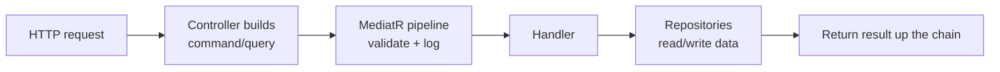
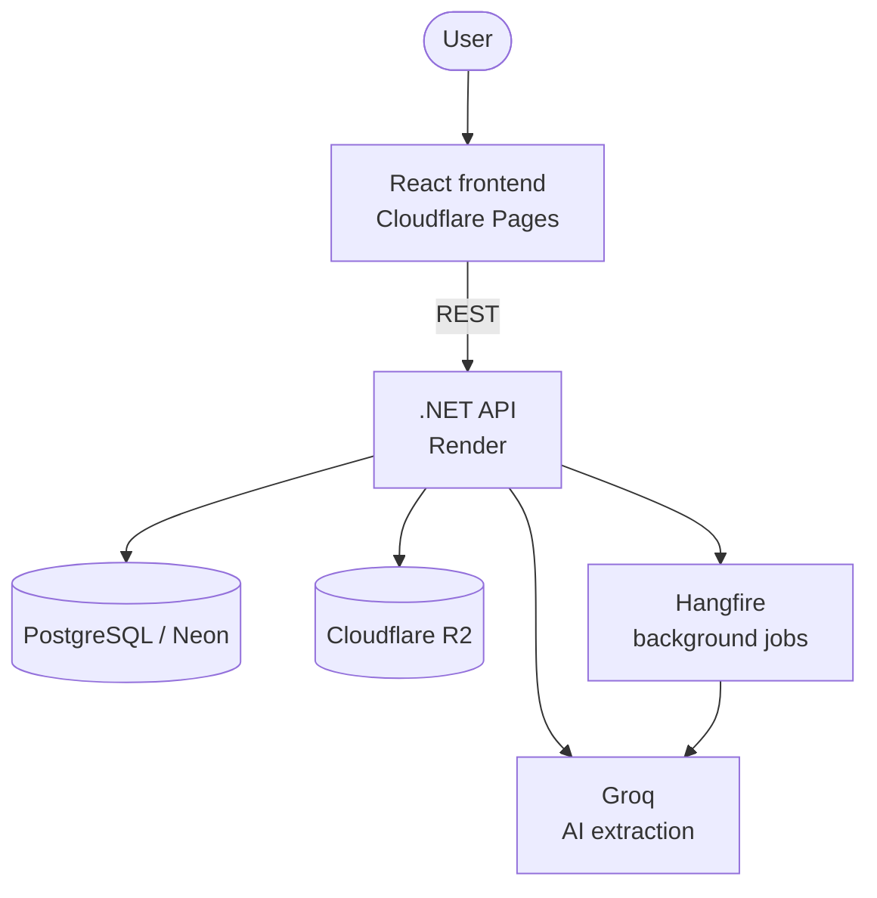

# DocuFlow

**Turn documents into structured data.** Upload an invoice, contract, receipt, or spreadsheet and DocuFlow extracts the fields you care about — automatically, in the background, with a confidence score on every value.

### 🔗 [Try the live demo →](https://docu-flow.pages.dev)

> **Note:** the demo backend spins down when it's not being used (that's how the free tier keeps costs at zero), so your **very first request may take ~10 seconds** while it spins back up. After that, it's quick.

|                                                |                                                              |
| ---------------------------------------------- | ------------------------------------------------------------ |
|     |  |
| _Your documents — with live processing status_ | _Drag-and-drop upload_                                       |

---

## What is this?

Imagine you have a pile of paperwork — invoices, contracts, receipts — and someone has to read each one and type the important bits into a system. DocuFlow does that for you. You:

1. **Upload** a document (PDF, TXT, CSV, or Excel).
2. **Wait a moment** while it's processed in the background.
3. **Get structured data back** — the fields defined by a schema (e.g. an invoice's number, date, total), each with a **confidence score** telling you how sure the AI is.

It's the same idea behind "intelligent document processing" and OCR-plus-AI pipelines used in finance and operations — built from scratch to show how that technology actually works end to end.

**Why it matters:** instead of manual data entry, an AI model reads each document against a **configurable schema** and returns typed fields you can trust (or flag for review, thanks to the confidence scores).

### Try it in 60 seconds

1. Open the [live demo](https://docu-flow.pages.dev) and register (any email + password — it's a demo, no verification).
2. **Upload** a document (a short invoice PDF or a `.csv` works great).
3. Watch it move through the pipeline: **Queued → Processing → Completed**.
4. Open the document to see the **extracted fields and confidence scores**.

---

## What it does (features)

- 🔐 **Secure, multi-tenant** — every tenant's documents are fully isolated at the database level.
- 📄 **Document upload** — drag and drop PDF / TXT / CSV / Excel (up to 5MB).
- 🤖 **AI extraction** — fields and confidence scores pulled per configurable schema (Invoice, Contract, Receipt, ID Document) via Groq.
- ⚙️ **Background processing** — uploads never block; a Hangfire job pipeline moves each document through Uploaded → Queued → Processing → Completed/Failed.
- 🔔 **Webhook notifications** — a webhook fires when extraction completes or fails, so downstream systems can react.
- 🔑 **Auth** — JWT access/refresh tokens.

---

## How it works

DocuFlow is an **intelligent document-processing pipeline**. Two flows do the work:

**Uploading & extracting a document (background):**


**A request, end to end:**



In short: the API stores the file, queues a job, and returns immediately. A background worker pulls the text out of the file, hands it to the language model along with the tenant's schema, and saves the typed fields — then notifies the tenant by webhook.

---

## Tech stack

| Area                | Technology                                                                                                  |
| ------------------- | ----------------------------------------------------------------------------------------------------------- |
| **Backend**         | .NET 10, ASP.NET Core Web API, Clean Architecture + CQRS (MediatR), EF Core (Npgsql), FluentValidation      |
| **AI**              | Groq (LLM extraction against a configurable per-tenant schema)                                              |
| **Text extraction** | PdfPig (PDF), EPPlus (Excel), plain reads (TXT/CSV)                                                         |
| **Background jobs** | Hangfire (queued extraction pipeline)                                                                       |
| **Frontend**        | React 18, TypeScript, Vite, TanStack Query, Tailwind CSS, React Hook Form + Zod, React Router, Axios        |
| **Auth**            | JWT access/refresh tokens, multi-tenant isolation                                                           |
| **API**             | API versioning, interactive docs via Scalar                                                                 |
| **Cloud**           | Render (API), Cloudflare Pages (frontend), Neon (PostgreSQL), Cloudflare R2 (file storage), MailKit (email) |

---

## Architecture



DocuFlow follows **Clean Architecture**, with the dependency rule flowing inward:

- **Domain** — entities, enums, domain events. No external dependencies.
- **Application** — CQRS handlers via MediatR, repository interfaces. Defines _what_ the system does.
- **Infrastructure** — EF Core + PostgreSQL, Hangfire, Cloudflare R2, Groq, MailKit. The _how_.
- **Api** — controllers, JWT middleware, tenant resolution, DI wiring.

Multi-tenancy is enforced at the database level via **EF Core global query filters** — every query is automatically scoped to the current tenant, so one tenant can never see another's data.

---

## Engineering highlights

A few things worth calling out for a technical review:

- **Database-level multi-tenancy** — tenant isolation is enforced by EF Core global query filters, not scattered `WHERE` clauses, so it can't be forgotten on a new query.
- **Non-blocking ingestion** — uploads return immediately; a Hangfire pipeline moves each document through explicit states (Uploaded → Queued → Processing → Completed/Failed) with failure handling.
- **Schema-driven extraction** — the AI extracts against a configurable per-tenant schema (Invoice, Contract, Receipt, ID Document) and returns a confidence score per field for human-in-the-loop review.
- **Format-aware text extraction** — PdfPig for PDFs, EPPlus for Excel, plain reads for TXT/CSV, all behind a common interface.
- **CQRS with pipeline behaviours** — validation (FluentValidation) and logging run as MediatR pipeline behaviours, keeping handlers focused on business logic.
- **Webhook notifications** — downstream systems are notified on completion or failure instead of polling.

---

## Running locally

**Prerequisites:** Docker, .NET 10 SDK, Node 18+.

```bash
# 1. Start Postgres
docker-compose up -d              # Postgres on localhost:5432

# 2. Run the backend
dotnet run --project src/DocuFlow.Api   # API on http://localhost:5108, docs at /scalar

# 3. Start the frontend
cd frontend
npm install
npm run dev                       # http://localhost:5173
```

EF Core migrations run automatically on startup, so the schema is created/updated on first run. Set `VITE_API_URL=http://localhost:5108/api` in `frontend/.env` if it isn't already.

Configuration is read from `appsettings.Development.json` (or environment variables / user-secrets) — never commit real secrets. A root-level [`.env.example`](.env.example) lists the required keys (Postgres connection, `Jwt__*`, `Groq__ApiKey`, `R2__*`, `Email__*`, `Cors__AllowedOrigins`).

**Run the tests:**

```bash
dotnet test tests/DocuFlow.UnitTests
dotnet test tests/DocuFlow.IntegrationTests
```

Integration tests use `WebApplicationFactory` with a unique in-memory database per run to avoid state bleed.

---

## Deployment

- **Backend** — deployed to [Render](https://render.com) as a Docker web service.
- **Frontend** — deployed to [Cloudflare Pages](https://pages.cloudflare.com), built from `frontend/` (`npm run build` → `dist`).
- **Database** — [Neon](https://neon.tech) serverless Postgres.
- **Files** — [Cloudflare R2](https://developers.cloudflare.com/r2/) for document storage.

To keep costs near zero, the demo uses free/low tiers that scale to zero when idle — hence the ~10 second wake-up on the first request after a quiet period.

---

## Project structure

```
src/
├── DocuFlow.Domain          # Entities, enums, domain events — no dependencies
├── DocuFlow.Application      # CQRS handlers, interfaces (the "what")
├── DocuFlow.Infrastructure   # EF Core, Hangfire, R2, Groq, MailKit (the "how")
└── DocuFlow.Api              # Controllers, JWT, tenant resolution, DI
frontend/                     # React + TypeScript app
tests/                        # Unit and integration suites
```

---

_Built as a portfolio project to demonstrate modern backend engineering (Clean Architecture, CQRS, multi-tenancy, background processing) and AI-powered document extraction on cloud-native infrastructure._
