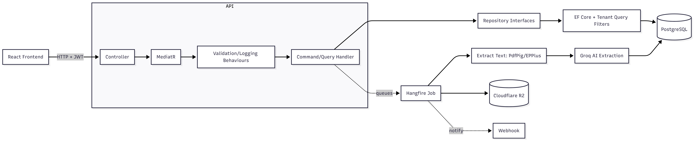

# DocuFlow

A multi-tenant document processing app — upload an invoice, contract, or spreadsheet, and DocuFlow extracts the structured data for you using AI, all in the background. Each tenant's data is fully isolated at the database level.

Built with .NET 10 (Clean Architecture + CQRS) on the backend and React + TypeScript on the frontend.

**Live demo:** https://docuflow-7lo.pages.dev

## Screenshots

**Dashboard** — overview of recent documents, extraction stats, and processing status


**Upload** — drag and drop a file, it gets queued and processed automatically


**Document detail** — extracted fields with confidence scores


## How it works

When you upload a file, the API stores it in Cloudflare R2 and creates an extraction job in Postgres. A Hangfire background job picks it up and walks it through the pipeline: text gets pulled out of the file (PdfPig for PDFs, EPPlus for Excel, plain reads for TXT/CSV), then sent to Groq along with the tenant's configured schema. The extracted fields and confidence scores get saved, and a webhook fires off to let the tenant know it's done (or if it failed).

## Architecture

The backend follows Clean Architecture, split into four layers:

- **Domain** — entities, enums, domain events. No external dependencies.
- **Application** — CQRS handlers via MediatR, repository interfaces. Defines _what_ the system does.
- **Infrastructure** — EF Core + PostgreSQL, Hangfire, Cloudflare R2, Groq, MailKit. The _how_.
- **Api** — controllers, JWT middleware, tenant resolution, DI wiring.

The dependency rule flows inward — Domain knows nothing about Application, Application knows nothing about Infrastructure. Infrastructure implements interfaces defined in Application (repository pattern), and everything gets wired up via DI at startup. This means the core business logic doesn't care whether data comes from Postgres, a mock, or something else — handy for testing and for swapping providers later.

**A request, end to end:** a controller receives the HTTP call, builds a command/query object, and sends it through MediatR. A pipeline behaviour validates it (FluentValidation), logs it, then hands it to the matching handler. The handler talks to repositories (interfaces in Application, implementations in Infrastructure) to read/write data, and returns a result back up the chain to the controller.

**Multi-tenancy** is enforced via EF Core global query filters — every query is automatically scoped to the current tenant based on the JWT, so cross-tenant data leaks aren't really possible regardless of how a query is written downstream.

**Background processing** — uploads don't block the request. Hangfire picks up the extraction job afterwards and moves it through a status pipeline (Uploaded → Queued → Processing → Completed/Failed), so the API stays responsive even while AI extraction is happening.



## Tech stack

**Backend**

- .NET 10, ASP.NET Core
- Clean Architecture + CQRS + MediatR
- Entity Framework Core + PostgreSQL (hosted on Neon)
- Hangfire for background jobs
- JWT auth + multi-tenancy via global query filters

**Frontend**

- React 18 + TypeScript + Vite
- Tailwind CSS
- TanStack Query + React Hook Form + Zod

**AI & processing**

- Groq API for field extraction
- PdfPig / EPPlus for text extraction
- Cloudflare R2 for file storage
- MailKit for email notifications

**Testing**

- xUnit + WebApplicationFactory integration tests
- Unique in-memory DB per test run to avoid state bleed

**Hosting**

- Frontend on Cloudflare Pages
- API on Render (Docker)
- Database on Neon (Postgres)
- File storage on Cloudflare R2

## Running locally

You'll need .NET 10 SDK, Node 18+, and a Postgres database (or a free Neon project).

```bash
# Backend
cd src/DocuFlow.Api
dotnet run

# Frontend
cd frontend
npm install
npm run dev
```

Create `src/DocuFlow.Api/appsettings.Development.json` with your own values:

| Key                                    | Description                       |
| -------------------------------------- | --------------------------------- |
| `ConnectionStrings__DefaultConnection` | PostgreSQL connection string      |
| `Jwt__Secret`                          | JWT signing secret (min 32 chars) |
| `Groq__ApiKey`                         | Groq API key                      |
| `R2__AccountId`                        | Cloudflare R2 account ID          |
| `R2__AccessKeyId`                      | Cloudflare R2 access key          |
| `R2__SecretAccessKey`                  | Cloudflare R2 secret key          |
| `R2__BucketName`                       | R2 bucket name                    |
| `Email__SmtpHost`                      | SMTP host                         |
| `Email__Username`                      | SMTP username                     |
| `Email__Password`                      | SMTP password                     |
| `Cors__AllowedOrigins`                 | Frontend URL                      |

EF Core migrations run automatically on startup, so the database schema gets created/updated on first run.

## Author

Arvind Chauhan, Software Developer, NZ
GitHub: https://github.com/erwin09chauhan/docuflow
