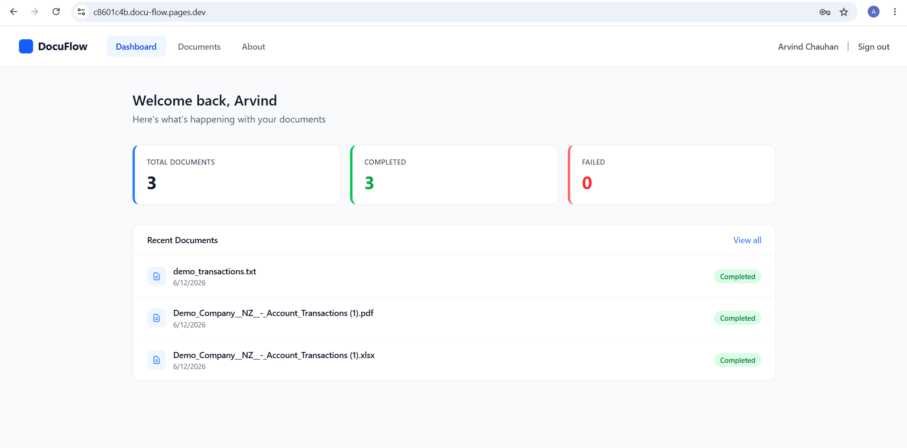
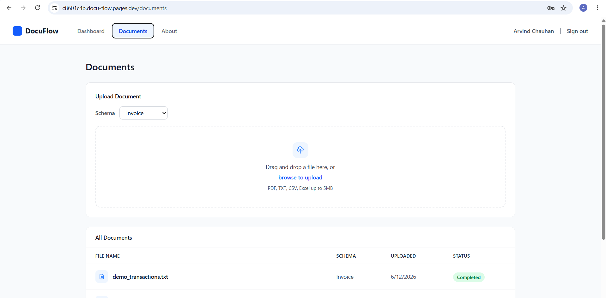
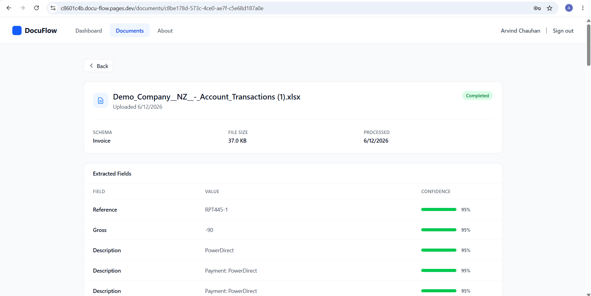
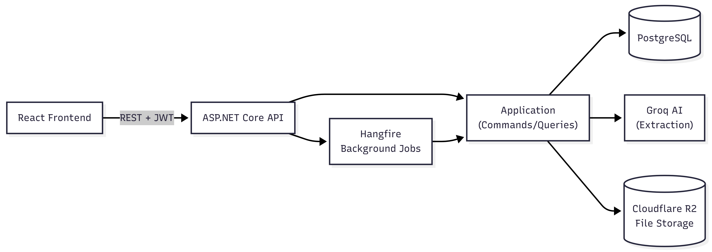

<h1 align="center">DocuFlow</h1>

<p align="center">
  A multi-tenant document processing app that extracts structured data from invoices, contracts, and spreadsheets using AI.
</p>

<p align="center">
  <a href="https://docu-flow.pages.dev"><strong>🔗 Live Demo</strong></a> ·
  <a href="https://docuflow-jvuo.onrender.com/scalar">API Docs</a>
</p>

<p align="center">
  <em>Note: the backend is hosted on Render's free tier and may take 30-60s to wake up on first request.</em>
</p>

---

## Overview

DocuFlow lets users upload an invoice, contract, receipt, or spreadsheet and get back structured, extracted data — automatically, in the background. Upload a file, it gets queued, processed by AI, and the results show up with confidence scores per field.

The backend is a **.NET 10 Clean Architecture + CQRS** app, split into Domain, Application, Infrastructure, and API layers, with multi-tenancy enforced at the database level via EF Core global query filters — every query is automatically scoped to the current tenant.

---

## Features

- **Document upload** — drag and drop PDF, TXT, CSV, or Excel files (up to 5MB)
- **AI extraction** — fields and confidence scores extracted via Groq, per configurable schema (Invoice, Contract, Receipt, ID Document)
- **Background processing** — uploads don't block; a Hangfire job pipeline moves documents through Uploaded → Queued → Processing → Completed/Failed
- **Multi-tenancy** — tenant data fully isolated via EF Core global query filters
- **Notifications** — webhook fires when extraction completes or fails
- **Auth** — JWT access/refresh tokens

---

## Screenshots

| Dashboard                                   | Upload                                         |
| ------------------------------------------- | ---------------------------------------------- |
|  |  |

| Document Detail                                         |
| ------------------------------------------------------- |
|  |

---

## Tech Stack

**Backend** — .NET 10, ASP.NET Core, Clean Architecture + CQRS + MediatR, EF Core (Npgsql), FluentValidation, Hangfire, JWT Auth, API Versioning + Scalar

**Frontend** — React 18 + Vite + TypeScript, TanStack Query, Tailwind CSS, React Hook Form + Zod, React Router, Axios

**Infrastructure** — Neon (Postgres), Cloudflare R2 (file storage), Groq (AI extraction), MailKit (email), Render (backend), Cloudflare Pages (frontend)

---

## Architecture

DocuFlow follows **Clean Architecture**, with the dependency rule flowing inward:

- **Domain** — entities, enums, domain events. No external dependencies.
- **Application** — CQRS handlers via MediatR, repository interfaces. Defines _what_ the system does.
- **Infrastructure** — EF Core + PostgreSQL, Hangfire, Cloudflare R2, Groq, MailKit. The _how_.
- **Api** — controllers, JWT middleware, tenant resolution, DI wiring.

**A request, end to end:** a controller receives the HTTP call, builds a command/query object, and sends it through MediatR. A pipeline behaviour validates it (FluentValidation), logs it, then hands it to the matching handler. The handler talks to repositories (interfaces in Application, implementations in Infrastructure) to read/write data, and returns a result back up the chain to the controller.

**How extraction works:** when a file is uploaded, the API stores it in Cloudflare R2 and creates an extraction job in Postgres. A Hangfire background job picks it up, pulls text out of the file (PdfPig for PDFs, EPPlus for Excel, plain reads for TXT/CSV), and sends it to Groq along with the tenant's configured schema. Extracted fields and confidence scores are saved, and a webhook fires to notify the tenant.



---

## Getting Started (Local Development)

### Prerequisites

- [.NET 10 SDK](https://dotnet.microsoft.com/download)
- [Node.js 18+](https://nodejs.org/) and npm
- [Docker](https://www.docker.com/) (for local Postgres)

### 1. Start the database

```bash
docker-compose up -d
```

This starts a local Postgres instance on `localhost:5432`.

### 2. Configure backend secrets

The API reads configuration via `appsettings.Development.json` (or environment variables / user-secrets) — never commit real secrets. Required keys are listed in [Environment Variables](#environment-variables) below.

A root-level [`.env.example`](.env.example) is provided as a reference for the env var names/format — copy it to `.env` and fill in real values, or transfer the keys into `appsettings.Development.json` / user-secrets.

### 3. Run the backend

```bash
dotnet run --project src/DocuFlow.Api
```

EF Core migrations run automatically on startup, so the database schema is created/updated on first run. API available at `http://localhost:5108`, with interactive docs at `/scalar`.

### 4. Run the frontend

```bash
cd frontend
npm install
npm run dev
```

Frontend available at `http://localhost:5173`. Set `VITE_API_URL=http://localhost:5108/api` in `frontend/.env` if not already configured.

---

## Environment Variables

| Variable                                                                           | Description                                |
| ---------------------------------------------------------------------------------- | ------------------------------------------ |
| `ConnectionStrings__DefaultConnection`                                             | PostgreSQL connection string               |
| `Jwt__Secret` / `Issuer` / `Audience` / `ExpiryMinutes` / `RefreshTokenExpiryDays` | JWT signing config                         |
| `Groq__ApiKey`                                                                     | Groq API key for AI extraction             |
| `R2__AccountId` / `AccessKeyId` / `SecretAccessKey` / `BucketName`                 | Cloudflare R2 credentials for file storage |
| `Email__SmtpHost` / `SmtpPort` / `FromAddress` / `Username` / `Password`           | SMTP config for email notifications        |
| `Cors__AllowedOrigins`                                                             | CORS allowed origin (frontend URL)         |
| `VITE_API_URL` (frontend)                                                          | Base URL of the backend API                |

---

## Deployment

- **Backend** — deployed to [Render](https://render.com) as a Docker web service
- **Frontend** — deployed to [Cloudflare Pages](https://pages.cloudflare.com), built from `frontend/` (`npm run build` → `dist`)
- **Database** — [Neon](https://neon.tech) serverless Postgres
- **Files** — [Cloudflare R2](https://developers.cloudflare.com/r2/) for document storage

---

## Testing

```bash
# Unit tests
dotnet test tests/DocuFlow.UnitTests

# Integration tests
dotnet test tests/DocuFlow.IntegrationTests
```

Integration tests use `WebApplicationFactory` with a unique in-memory database per test run to avoid state bleed.
